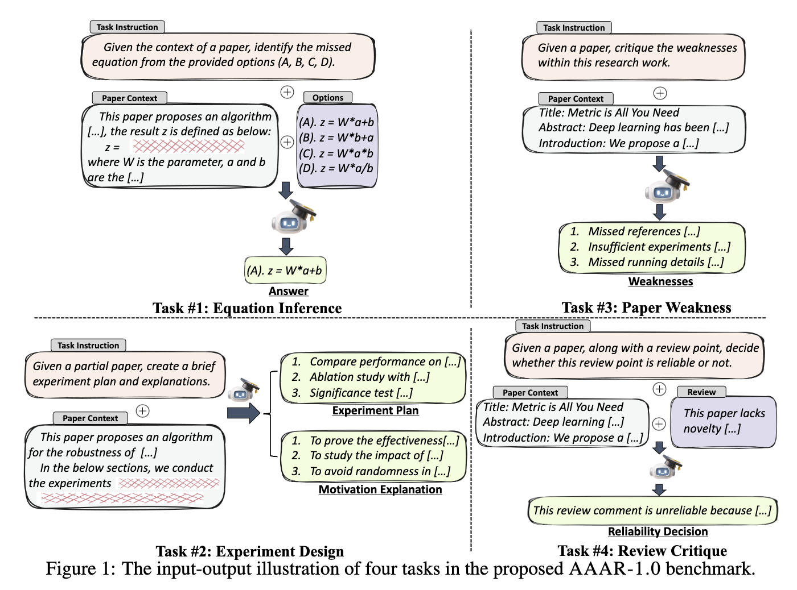

<h1 align="center"> AAAR-1.0: Assessing AI's Potential to Assist Research </h1>

<p align="center">
<a href="https://renzelou.github.io/AAAR-1.0/"></a>
<a href="https://arxiv.org/abs/2410.22394"></a>
  <a href="https://github.com/RenzeLou/AAAR-1.0/blob/main/LICENSE"></a>
  <!-- <a href="https://github.com/RenzeLou/Muffin"></a> -->
</p>

This repository contains the source code for running the LLMs' performance on the [AAAR-1.0 benchmark](https://renzelou.github.io/AAAR-1.0/).

<p align="center" width="100%">
<a ></a>
</p>

We dfined four tasks in the AAAR-1.0 benchmark:
- (i) 𝙀𝙦𝙪𝙖𝙩𝙞𝙤𝙣 𝙄𝙣𝙛𝙚𝙧𝙚𝙣𝙘𝙚 🌟: Based on the context of the related paper, such as the description and necessary symbols of an AI/ML algorithm, infer the correct mathematical equation for the algorithm.

- (ii) 𝙀𝙭𝙥𝙚𝙧𝙞𝙢𝙚𝙣𝙩 𝘿𝙚𝙨𝙞𝙜𝙣 🧪: Given a partial research paper containing the research idea or proposal (primarily the "Abstract" or "Introduction" sections), design appropriate experiments and explain their necessity.

- (iii) 𝙋𝙖𝙥𝙚𝙧 𝙒𝙚𝙖𝙠𝙣𝙚𝙨𝙨 🔍: Given a paper draft, write the review (weaknesses) of this work, i.e., LLMs act as reviewers.

- (iv) 𝙍𝙚𝙫𝙞𝙚𝙬 𝘾𝙧𝙞𝙩𝙞𝙦𝙪𝙚 ✍️: Given a paper draft along with its peer review, identify any unreliable or deficient viewpoints, i.e., LLMs act as meta reviewers.


---


## Benchmark Download

Please download AAAR-1.0 from 🤗 HuggingFace: [https://huggingface.co/datasets/Reza8848/AAAR-1.0](https://huggingface.co/datasets/Reza8848/AAAR-1.0)


## Environment Setup

For running closed-source LLMs (e.g., OpenAI GPT), we use [litellm](https://github.com/BerriAI/litellm) to unify various model calling APIs, please setup the following environment:

```bash
conda env create -f environment.litellm.yml
conda activate litellm
```

while for running open-source LLMs (e.g., Llama), we mainly use [vllm](https://github.com/vllm-project/vllm), please setup the following environment:

```bash
conda env create -f environment.vllm.yml
conda activate vllm
```

** If you wanna run open-source LLMs with multi-modal inputs, please use `environment.vllm_mm.yml`


## API Tokens

When running closed-source commercial LLMs, you can set the API tokens in the environment variables, for example: 
```bash
export OPENAI_API_KEY='your-api-key-here'
export ANTHROPIC_API_KEY='your-api-key-here'
```

or write them in the `~/.bashrc` or `~/.zshrc` file.

While for running open-source LLMs from HuggingFace, you have to write a `huggingface_key.txt` file in this project root directory, and put your Huggingface Access Token in it.

## Running the Benchmark

### 1. Equation Inference 🌟:

- For **closed-source** LLMs, please using the following command:

```bash
conda activate litellm
python scripts/subtask1_equation_model_eval.py --root_dir './subtask1_equation_unified' --eval_data_file '1049.human_filter.json' --save_dir './subtask1_equation_unified/eval_results' --context_max_len [max_context_len] --api_name [model_name]

# for example
python scripts/subtask1_equation_model_eval.py --root_dir './subtask1_equation_unified' --eval_data_file '1049.human_filter.json' --save_dir './subtask1_equation_unified/eval_results' --context_max_len 1000 --api_name 'o1-preview'
```

- For **open-source** LLMs (such as Llama), please using the following command:

```bash
conda activate vllm
sh scripts/run_subtask1.sh [GPU_IDs] [model_name] [max_context_len] [max_model_len]

# for example
sh scripts/run_subtask1.sh 6,7 meta-llama/Meta-Llama-3.1-70B-Instruct 1000 10000
```

All the evaluation results are saved to `./subtask1_equation_unified/eval_results` directory.


### 2. Experiment Design 🧪:

- For **closed-source** LLMs, please using the following command:

```bash
 conda activate litellm
python scripts/subtask2_experiment_model_prediction.close_source.v2.py --root_dir "./subtask2_experiment_human_anno/final_data" --save_dir "./subtask2_experiment_human_anno/eval_results" --oracle --max_word_len [max_context_len] --api_name [model_name]

# for example
python scripts/subtask2_experiment_model_prediction.close_source.v2.py --root_dir "./subtask2_experiment_human_anno/final_data" --save_dir "./subtask2_experiment_human_anno/eval_results" --max_word_len 3000 --api_name "gpt-4o" --oracle
```

- For **open-source** LLMs, please using the following command:

```bash
conda activate vllm
sh scripts/run_subtask2.v2.sh [GPU_IDs] [model_name] [max_context_len] [max_model_len]

# for example
sh scripts/run_subtask2.v2.sh 2,3,4,5 Qwen/Qwen2.5-72B-Instruct 3000 8192
```

All the evaluation results are saved to `./subtask2_experiment_human_anno/eval_results` directory.


- **Evaluation Metrics**:

Use the following command to run SentenceBERT to evaluate the model performance:

```bash
python scripts/subtask2_metric.py --root_dir './subtask2_experiment_human_anno/eval_results/xxx'  ## use the specific model results directory
```


### 3. Paper Weakness 🔍:

- For **closed-source** LLMs, please using the following command:

```bash
conda activate litellm
python scripts/subtask3_review_model_prediction.close_source.py --root_dir './subtask3_review_final_v2' --save_dir './subtask3_review_final_v2/eval_results' --split --max_word_len [max_context_len] --api_name [model_name]

# for example
python scripts/subtask3_review_model_prediction.close_source.py --api_name 'gpt-4o' --root_dir './subtask3_review_final_v2' --save_dir './subtask3_review_final_v2/eval_results' --split --max_word_len 3000
```

- For **open-source** LLMs, please using the following command:

```bash
conda activate vllm
sh scripts/run_subtask3.sh [GPU_IDs] [model_name] [max_context_len] [max_model_len] [split_context]

# for example
sh scripts/run_subtask3.sh 4,5,6,7 Qwen/Qwen2.5-72B-Instruct 3000 8192 1  # "1" means split context into multiple parts, and combine the results afterwards
```

- **Evaluation Metrics**:

```bash
python scripts/subtask3_metric.py  # soft score
python scripts/subtask3_metric_cross_diversity.py --batch_size 512 --papaer_top_k 2 --track_top_k 20 --threshold 0.5 # weakness diversity
```


### 4. Review Critique ✍️:

Please refer to [this repository](https://github.com/jiangshdd/ReviewCritique) for more details on running the review critique task.

---

## 🥳 Citation

Please kindly cite our paper if you use any resources in this repository:


```bibtex
@article{Lou2024AAAR,
  title={{AAAR-1.0}: Assessing AI's Potential to Assist Research},
  author={Renze Lou and Hanzi Xu and Sijia Wang and Jiangshu Du and Ryo Kamoi and Xiaoxin Lu and Jian Xie and Yuxuan Sun and Yusen Zhang and Jihyun Janice Ahn and Hongchao Fang and Zhuoyang Zou and Wenchao Ma and Xi Li and Kai Zhang and Congying Xia and Lifu Huang and Wenpeng Yin},
  journal={arXiv preprint arXiv:2410.22394},
  year={2024}
}

@inproceedings{du2024llms,
  title={Llms assist nlp researchers: Critique paper (meta-) reviewing},
  author={Du, Jiangshu and Wang, Yibo and Zhao, Wenting and Deng, Zhongfen and Liu, Shuaiqi and Lou, Renze and Zou, Henry Peng and Venkit, Pranav Narayanan and Zhang, Nan and Srinath, Mukund and others},
  journal={Proceedings of {EMNLP} },
  year={2024}
}
```


---

<!-- omit in toc -->
## ⭐ Star History


[](https://star-history.com/#RenzeLou/AAAR-1.0&Date)